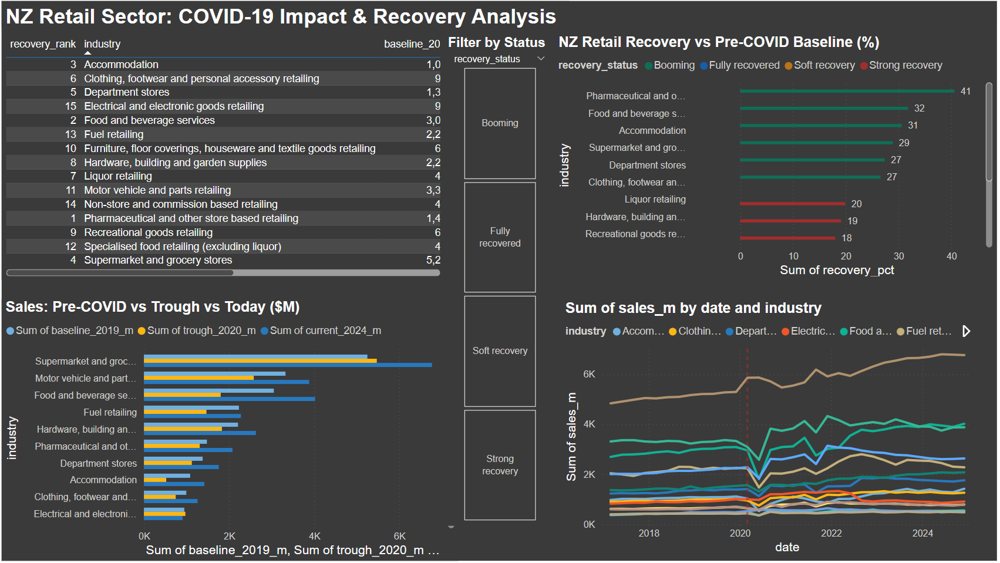

# NZ Retail Sector: COVID-19 Impact & Recovery Analysis

## Project Overview
An end-to-end data analysis project examining how New Zealand's 
retail sectors were impacted by COVID-19 and how they have recovered 
through to December 2024.

## Data Source
New Zealand Retail Trade Survey — Stats NZ (Official Government Data)
- 26,958 rows of quarterly retail sales data
- Date range: 1995–2024
- 15 retail industries tracked

## Tools Used
- **PostgreSQL** — data storage and SQL analysis
- **pgAdmin 4** — database management
- **Power BI Desktop** — dashboard and visualisation

## Key Business Question
> Which NZ retail sectors recovered fastest post-COVID,
> and which are still struggling?

## Methodology

### Step 1 — Data Ingestion
Loaded raw CSV from Stats NZ into a PostgreSQL database
and created a structured table with 14 columns.

### Step 2 — Data Cleaning & Filtering
Filtered 26,958 rows down to seasonally adjusted,
current price, sales income data using SQL WHERE clauses.

### Step 3 — SQL Analysis
Built a multi-step SQL pipeline using:
- Common Table Expressions (CTEs)
- Percentage change calculations
- RANK() window functions
- CASE WHEN classification logic

### Step 4 — Visualisation
Built an interactive Power BI dashboard with:
- Recovery % bar chart by industry
- Sales trend line chart (2017–2024) with COVID-19 marker
- Before/during/after clustered bar chart
- Full recovery rankings table with conditional formatting
- Interactive slicer to filter by recovery status

## Key Findings
- Pharmaceutical retail led recovery at +41% above pre-COVID levels
- Food and beverage services recovered strongly at +32%
- Accommodation was hardest hit dropping 52% during COVID lockdowns
- Electrical and electronic goods is the only sector still below
  pre-COVID levels at -4%

## Files
| File | Description |
|------|-------------|
| `analysis.sql` | All SQL queries used in this project |
| `retail-trade-survey-december-2024-quarter.csv` | Raw data from Stats NZ |
| `nz-retail-covid-recovery-analysis.png.png` | Power BI dashboard screenshot |
